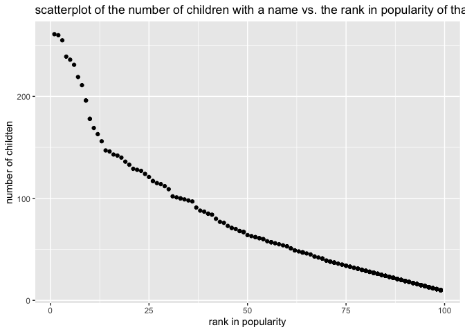

P8105 Homework 2
================

Problem 1

The code chunk below reads and cleans Mr.Trash Wheel sheet.

``` r
trash_wheel_sheet = read_excel("hw2_data/Trash-Wheel-Collection-Totals-7-2020-2.xlsx", sheet = "Mr. Trash Wheel", range = "A2:N535") %>%
  janitor::clean_names() %>%
  drop_na(dumpster) %>%
  mutate(sports_balls = round(sports_balls))
trash_wheel_sheet
```

    ## # A tibble: 454 × 14
    ##    dumpster month  year date                weight_tons volume_cubic_yards
    ##    <chr>    <chr> <dbl> <dttm>                    <dbl>              <dbl>
    ##  1 1        May    2014 2014-05-16 00:00:00        4.31                 18
    ##  2 2        May    2014 2014-05-16 00:00:00        2.74                 13
    ##  3 3        May    2014 2014-05-16 00:00:00        3.45                 15
    ##  4 4        May    2014 2014-05-17 00:00:00        3.1                  15
    ##  5 5        May    2014 2014-05-17 00:00:00        4.06                 18
    ##  6 6        May    2014 2014-05-20 00:00:00        2.71                 13
    ##  7 7        May    2014 2014-05-21 00:00:00        1.91                  8
    ##  8 8        May    2014 2014-05-28 00:00:00        3.7                  16
    ##  9 9        June   2014 2014-06-05 00:00:00        2.52                 14
    ## 10 10       June   2014 2014-06-11 00:00:00        3.76                 18
    ## # … with 444 more rows, and 8 more variables: plastic_bottles <dbl>,
    ## #   polystyrene <dbl>, cigarette_butts <dbl>, glass_bottles <dbl>,
    ## #   grocery_bags <dbl>, chip_bags <dbl>, sports_balls <dbl>,
    ## #   homes_powered <dbl>

The code chunk below reads and cleans precipitation data for 2018.

``` r
precipitation_2018 = read_excel("hw2_data/Trash-Wheel-Collection-Totals-7-2020-2.xlsx", sheet = "2018 Precipitation", range = "A2:B14") %>%
  janitor::clean_names() %>%
  mutate(year = 2018)
precipitation_2018
```

    ## # A tibble: 12 × 3
    ##    month total  year
    ##    <dbl> <dbl> <dbl>
    ##  1     1  0.94  2018
    ##  2     2  4.8   2018
    ##  3     3  2.69  2018
    ##  4     4  4.69  2018
    ##  5     5  9.27  2018
    ##  6     6  4.77  2018
    ##  7     7 10.2   2018
    ##  8     8  6.45  2018
    ##  9     9 10.5   2018
    ## 10    10  2.12  2018
    ## 11    11  7.82  2018
    ## 12    12  6.11  2018

The code chunk below reads and cleans precipitation data for 2019.

``` r
precipitation_2019 = 
read_excel("hw2_data/Trash-Wheel-Collection-Totals-7-2020-2.xlsx", sheet = "2019 Precipitation", range = "A2:B14") %>%
  janitor::clean_names() %>%
  mutate(year = 2019)
precipitation_2019
```

    ## # A tibble: 12 × 3
    ##    month total  year
    ##    <dbl> <dbl> <dbl>
    ##  1     1  3.1   2019
    ##  2     2  3.64  2019
    ##  3     3  4.47  2019
    ##  4     4  1.46  2019
    ##  5     5  3.58  2019
    ##  6     6  0.42  2019
    ##  7     7  3.85  2019
    ##  8     8  2.39  2019
    ##  9     9  0.16  2019
    ## 10    10  5.45  2019
    ## 11    11  1.86  2019
    ## 12    12  3.57  2019

The code chunk below combines precipitation datasets and converts month
to a character variable.

``` r
precipitation_combined = bind_rows(precipitation_2018, precipitation_2019) %>%
  mutate(month = month.name[month])
precipitation_combined
```

    ## # A tibble: 24 × 3
    ##    month     total  year
    ##    <chr>     <dbl> <dbl>
    ##  1 January    0.94  2018
    ##  2 February   4.8   2018
    ##  3 March      2.69  2018
    ##  4 April      4.69  2018
    ##  5 May        9.27  2018
    ##  6 June       4.77  2018
    ##  7 July      10.2   2018
    ##  8 August     6.45  2018
    ##  9 September 10.5   2018
    ## 10 October    2.12  2018
    ## # … with 14 more rows

The number of observations in the resulting Mr.Trash Wheel dataset is
454. Names of key variables are dumpster, month, year, date,
weight\_tons, volume\_cubic\_yards, plastic\_bottles, polystyrene,
cigarette\_butts, glass\_bottles, grocery\_bags, chip\_bags,
sports\_balls, homes\_powered. The number of observations in the
resulting combined precipitation dataset is 24. Names of key variables
are month, total, year. The total precipitation in 2018 is 70.33. The
median number of sports balls in a dumpster in 2019 is 9.

Problem 2

The code chunk below deals with data in pols-month.csv.

``` r
pols_month_data = read_csv("hw2_data/fivethirtyeight_datasets/pols-month.csv") %>% 
  separate(mon, into = c("year", "month", "day")) %>%
  mutate(year = as.integer(year), month = as.integer(month), day = as.integer(day)) %>%
  mutate(month = month.name[(month)]) %>%
  rename(dem = prez_dem) %>%
  rename(gop = prez_gop) %>%
  pivot_longer(c(dem, gop), names_to = "party", values_to = "president") %>%
  select(-day)
```

    ## Rows: 822 Columns: 9

    ## ── Column specification ────────────────────────────────────────────────────────
    ## Delimiter: ","
    ## dbl  (8): prez_gop, gov_gop, sen_gop, rep_gop, prez_dem, gov_dem, sen_dem, r...
    ## date (1): mon

    ## 
    ## ℹ Use `spec()` to retrieve the full column specification for this data.
    ## ℹ Specify the column types or set `show_col_types = FALSE` to quiet this message.

``` r
pols_month_data
```

    ## # A tibble: 1,644 × 10
    ##     year month    gov_gop sen_gop rep_gop gov_dem sen_dem rep_dem party president
    ##    <int> <chr>      <dbl>   <dbl>   <dbl>   <dbl>   <dbl>   <dbl> <chr>     <dbl>
    ##  1  1947 January       23      51     253      23      45     198 dem           1
    ##  2  1947 January       23      51     253      23      45     198 gop           0
    ##  3  1947 February      23      51     253      23      45     198 dem           1
    ##  4  1947 February      23      51     253      23      45     198 gop           0
    ##  5  1947 March         23      51     253      23      45     198 dem           1
    ##  6  1947 March         23      51     253      23      45     198 gop           0
    ##  7  1947 April         23      51     253      23      45     198 dem           1
    ##  8  1947 April         23      51     253      23      45     198 gop           0
    ##  9  1947 May           23      51     253      23      45     198 dem           1
    ## 10  1947 May           23      51     253      23      45     198 gop           0
    ## # … with 1,634 more rows

The code chunk below deals with data in snap.csv.

``` r
snp_data = read_csv("hw2_data/fivethirtyeight_datasets/snp.csv") %>%
  separate(date, into = c("month", "day", "year")) %>%
  arrange(year, as.numeric(month))
```

    ## Rows: 787 Columns: 2

    ## ── Column specification ────────────────────────────────────────────────────────
    ## Delimiter: ","
    ## chr (1): date
    ## dbl (1): close

    ## 
    ## ℹ Use `spec()` to retrieve the full column specification for this data.
    ## ℹ Specify the column types or set `show_col_types = FALSE` to quiet this message.

``` r
snp_data_1 = filter(snp_data, year >= 50) %>%
  mutate(year = as.numeric(year) + 1900)

snp_data_2 = filter(snp_data, year <= 15) %>%
  mutate(year = as.numeric(year) + 2000)

snp_data_final = bind_rows(snp_data_1, snp_data_2) %>%
  mutate(month = month.name[as.integer(month)]) %>%
  select(-day) %>%
  relocate(year, month)
snp_data_final
```

    ## # A tibble: 787 × 3
    ##     year month     close
    ##    <dbl> <chr>     <dbl>
    ##  1  1950 January    17.0
    ##  2  1950 February   17.2
    ##  3  1950 March      17.3
    ##  4  1950 April      18.0
    ##  5  1950 May        18.8
    ##  6  1950 June       17.7
    ##  7  1950 July       17.8
    ##  8  1950 August     18.4
    ##  9  1950 September  19.5
    ## 10  1950 October    19.5
    ## # … with 777 more rows

The code chunk below deals with unemployment data.

``` r
unemployment_data = read_csv("hw2_data/fivethirtyeight_datasets/unemployment.csv") %>%
  pivot_longer(Jan:Dec, names_to = "month", values_to = "unemployment rate") %>%
  janitor::clean_names() %>%
  mutate(month = recode(month, `Jan` = "January", `Feb` = "February", `Mar` = "March", `Apr` = "April", `Jun` = "June", `Jul` = "July", `Aug` = "August", `Sep` = "September", `Oct` = "October", `Nov` = "November", `Dec` = "December"))
```

    ## Rows: 68 Columns: 13

    ## ── Column specification ────────────────────────────────────────────────────────
    ## Delimiter: ","
    ## dbl (13): Year, Jan, Feb, Mar, Apr, May, Jun, Jul, Aug, Sep, Oct, Nov, Dec

    ## 
    ## ℹ Use `spec()` to retrieve the full column specification for this data.
    ## ℹ Specify the column types or set `show_col_types = FALSE` to quiet this message.

``` r
unemployment_data
```

    ## # A tibble: 816 × 3
    ##     year month     unemployment_rate
    ##    <dbl> <chr>                 <dbl>
    ##  1  1948 January                 3.4
    ##  2  1948 February                3.8
    ##  3  1948 March                   4  
    ##  4  1948 April                   3.9
    ##  5  1948 May                     3.5
    ##  6  1948 June                    3.6
    ##  7  1948 July                    3.6
    ##  8  1948 August                  3.9
    ##  9  1948 September               3.8
    ## 10  1948 October                 3.7
    ## # … with 806 more rows

The code chunk below join the datasets by merging snp\_data\_final into
pols\_month\_data, and merging unemployment\_data into the result.

``` r
polsmonth_snp = left_join(pols_month_data, snp_data_final)
```

    ## Joining, by = c("year", "month")

``` r
polsmonth_snp_unemployment = left_join(polsmonth_snp, unemployment_data)
```

    ## Joining, by = c("year", "month")

``` r
polsmonth_snp_unemployment
```

    ## # A tibble: 1,644 × 12
    ##     year month    gov_gop sen_gop rep_gop gov_dem sen_dem rep_dem party president
    ##    <dbl> <chr>      <dbl>   <dbl>   <dbl>   <dbl>   <dbl>   <dbl> <chr>     <dbl>
    ##  1  1947 January       23      51     253      23      45     198 dem           1
    ##  2  1947 January       23      51     253      23      45     198 gop           0
    ##  3  1947 February      23      51     253      23      45     198 dem           1
    ##  4  1947 February      23      51     253      23      45     198 gop           0
    ##  5  1947 March         23      51     253      23      45     198 dem           1
    ##  6  1947 March         23      51     253      23      45     198 gop           0
    ##  7  1947 April         23      51     253      23      45     198 dem           1
    ##  8  1947 April         23      51     253      23      45     198 gop           0
    ##  9  1947 May           23      51     253      23      45     198 dem           1
    ## 10  1947 May           23      51     253      23      45     198 gop           0
    ## # … with 1,634 more rows, and 2 more variables: close <dbl>,
    ## #   unemployment_rate <dbl>

The pols-month dataset has dimension 1644 x 10. The range of years is
from 1947 to 2015. Names of key variables are year, month, gov\_gop,
sen\_gop, rep\_gop, gov\_dem, sen\_dem, rep\_dem, party, president. The
snp dataset has dimension 787 x 3. The range of years is from 1950 to
2015. Names of key variables are year, month, close. The unemployment
dataset has dimension 816 x 3. The range of years is from 1948 to 2015.
Names of key variables are year, month, unemployment\_rate. The
resulting dataset has dimension 1644 x 12. The range of years is from
1947 to 2015. Names of key variables are year, month, gov\_gop,
sen\_gop, rep\_gop, gov\_dem, sen\_dem, rep\_dem, party, president,
close, unemployment\_rate.

Problem 3

The code chunk below loads and tidies popular baby names data.

``` r
popular_baby_names = read_csv("hw2_data/Popular_Baby_Names.csv") %>%
  janitor::clean_names() %>%
  mutate(ethnicity = recode(ethnicity, `WHITE NON HISP` = "WHITE NON HISPANIC", `ASIAN AND PACI` = "ASIAN AND PACIFIC ISLANDER", `BLACK NON HISP` = "BLACK NON HISPANIC"), childs_first_name = str_to_title(childs_first_name))
```

    ## Rows: 19418 Columns: 6

    ## ── Column specification ────────────────────────────────────────────────────────
    ## Delimiter: ","
    ## chr (3): Gender, Ethnicity, Child's First Name
    ## dbl (3): Year of Birth, Count, Rank

    ## 
    ## ℹ Use `spec()` to retrieve the full column specification for this data.
    ## ℹ Specify the column types or set `show_col_types = FALSE` to quiet this message.

``` r
popular_baby_names
```

    ## # A tibble: 19,418 × 6
    ##    year_of_birth gender ethnicity                  childs_first_name count  rank
    ##            <dbl> <chr>  <chr>                      <chr>             <dbl> <dbl>
    ##  1          2016 FEMALE ASIAN AND PACIFIC ISLANDER Olivia              172     1
    ##  2          2016 FEMALE ASIAN AND PACIFIC ISLANDER Chloe               112     2
    ##  3          2016 FEMALE ASIAN AND PACIFIC ISLANDER Sophia              104     3
    ##  4          2016 FEMALE ASIAN AND PACIFIC ISLANDER Emily                99     4
    ##  5          2016 FEMALE ASIAN AND PACIFIC ISLANDER Emma                 99     4
    ##  6          2016 FEMALE ASIAN AND PACIFIC ISLANDER Mia                  79     5
    ##  7          2016 FEMALE ASIAN AND PACIFIC ISLANDER Charlotte            59     6
    ##  8          2016 FEMALE ASIAN AND PACIFIC ISLANDER Sarah                57     7
    ##  9          2016 FEMALE ASIAN AND PACIFIC ISLANDER Isabella             56     8
    ## 10          2016 FEMALE ASIAN AND PACIFIC ISLANDER Hannah               56     8
    ## # … with 19,408 more rows

The code chunk below removes duplicated rows in popular baby names
dataset.

``` r
popular_baby_names_filtered = popular_baby_names[!duplicated(popular_baby_names[,1:6]),]
popular_baby_names_filtered
```

    ## # A tibble: 12,181 × 6
    ##    year_of_birth gender ethnicity                  childs_first_name count  rank
    ##            <dbl> <chr>  <chr>                      <chr>             <dbl> <dbl>
    ##  1          2016 FEMALE ASIAN AND PACIFIC ISLANDER Olivia              172     1
    ##  2          2016 FEMALE ASIAN AND PACIFIC ISLANDER Chloe               112     2
    ##  3          2016 FEMALE ASIAN AND PACIFIC ISLANDER Sophia              104     3
    ##  4          2016 FEMALE ASIAN AND PACIFIC ISLANDER Emily                99     4
    ##  5          2016 FEMALE ASIAN AND PACIFIC ISLANDER Emma                 99     4
    ##  6          2016 FEMALE ASIAN AND PACIFIC ISLANDER Mia                  79     5
    ##  7          2016 FEMALE ASIAN AND PACIFIC ISLANDER Charlotte            59     6
    ##  8          2016 FEMALE ASIAN AND PACIFIC ISLANDER Sarah                57     7
    ##  9          2016 FEMALE ASIAN AND PACIFIC ISLANDER Isabella             56     8
    ## 10          2016 FEMALE ASIAN AND PACIFIC ISLANDER Hannah               56     8
    ## # … with 12,171 more rows

The code chunk below produces a well-structured, reader-friendly table
showing the rank in popularity of the name “Olivia” as a female baby
name over time.

``` r
olivia_female_popularity = filter(popular_baby_names_filtered, childs_first_name == "Olivia", gender == "FEMALE") %>%
  arrange(year_of_birth) %>%
  pivot_wider(ethnicity, names_from = "year_of_birth", values_from = "rank") %>%
  knitr::kable()
olivia_female_popularity
```

| ethnicity                  | 2011 | 2012 | 2013 | 2014 | 2015 | 2016 |
|:---------------------------|-----:|-----:|-----:|-----:|-----:|-----:|
| ASIAN AND PACIFIC ISLANDER |    4 |    3 |    3 |    1 |    1 |    1 |
| BLACK NON HISPANIC         |   10 |    8 |    6 |    8 |    4 |    8 |
| HISPANIC                   |   18 |   22 |   22 |   16 |   16 |   13 |
| WHITE NON HISPANIC         |    2 |    4 |    1 |    1 |    1 |    1 |

The code chunk below produces a table showing the most popular name
among male children over time.

``` r
most_popular_male_name = filter(popular_baby_names_filtered, rank == "1", gender == "MALE") %>%
  arrange(year_of_birth) %>%
  pivot_wider(ethnicity, names_from = "year_of_birth", values_from = "childs_first_name") %>%
  knitr::kable()
most_popular_male_name
```

| ethnicity                  | 2011    | 2012   | 2013   | 2014   | 2015   | 2016   |
|:---------------------------|:--------|:-------|:-------|:-------|:-------|:-------|
| ASIAN AND PACIFIC ISLANDER | Ethan   | Ryan   | Jayden | Jayden | Jayden | Ethan  |
| BLACK NON HISPANIC         | Jayden  | Jayden | Ethan  | Ethan  | Noah   | Noah   |
| HISPANIC                   | Jayden  | Jayden | Jayden | Liam   | Liam   | Liam   |
| WHITE NON HISPANIC         | Michael | Joseph | David  | Joseph | David  | Joseph |

The code chunk below produce a scatter plot showing the number of
children with a name (y axis) against the rank in popularity of that
name (x axis) for male, white non-hispanic children born in 2016.

``` r
male_white_non_hispanic_2016 = filter(popular_baby_names_filtered, gender == "MALE", ethnicity == "WHITE NON HISPANIC", year_of_birth == 2016) %>% ggplot(aes(x = rank, y = count)) + geom_point()
male_white_non_hispanic_2016
```

<!-- -->
